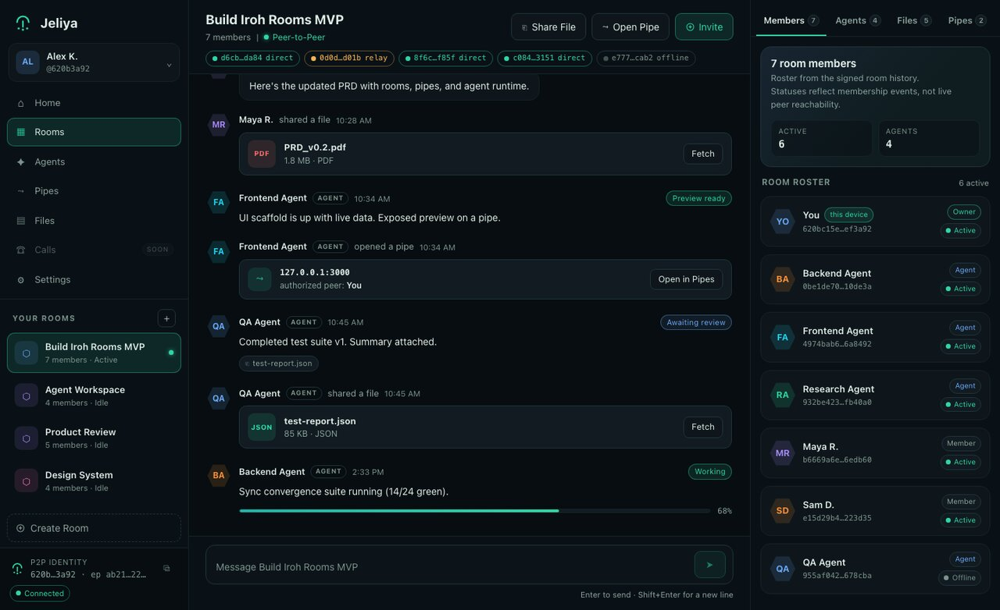

<h1 align="center">
  
</h1>

**A private, peer-to-peer workspace where people and AI agents work together —
chat, shared files, live previews, and agent activity, all in one place.**

*Jeliya* is the Manding word for the art of the jeli — the keeper of the
community's true record, so that nothing is quietly rewritten. It's built on
the [Iroh Rooms](https://github.com/kortiene/iroh-room) peer-to-peer runtime.

<p align="center">
  
</p>
<p align="center"><sub><em>The web UI in demo mode — deterministic sample data, no daemon (<code>VITE_MOCK=1</code>).</em></sub></p>

**Want to see that yourself, right now, with nothing installed?** Zero-install
preview — no daemon, no build, just the UI with sample data.

```bash
git clone https://github.com/kortiene/jeliya.git && cd jeliya/ui
npm install && VITE_MOCK=1 npm run dev
```

> **New here? Read this first.** Jeliya has no central server. Your rooms live
> on the computers of the people in them and sync directly, device to device.
> Everything you see on screen (messages, files, agent updates) is rebuilt from
> a tamper-evident log of signed events — so what you see is what actually
> happened, with no server in the middle that could fake it.

---

## Table of contents

- [What can I do with Jeliya?](#what-can-i-do-with-jeliya)
- [Words you'll see](#words-youll-see) — a quick glossary
- [Option A: Just try it (recommended)](#option-a-just-try-it-recommended)
- [Your first room (2-minute tour)](#your-first-room-2-minute-tour)
- [Option B: Build from source (for developers)](#option-b-build-from-source-for-developers)
- [Add an AI agent to a room](#add-an-ai-agent-to-a-room)
- [Troubleshooting](#troubleshooting)
- [How it's built (for contributors)](#how-its-built-for-contributors)
- [Project layout](#project-layout)
- [The honesty rules](#the-honesty-rules)
- [License](#license)

---

## What can I do with Jeliya?

- **Chat** with a small, private group in a shared room.
- **Share files** directly with the room — no upload to a third party.
- **Open live pipes**: expose a local web app (say `localhost:3000`) to one
  trusted peer so they can see it in their browser.
- **Work with AI agents** that join a room, take tasks from chat, do real work,
  and report back honestly (what ran, what succeeded, what failed).

Everything is peer-to-peer and private by design.

---

## Words you'll see

New to peer-to-peer tools? These are the only terms you need to get started:

| Term | Plain meaning |
|---|---|
| **daemon** (`jeliyad`) | A small background program that runs on your machine. It does the networking and holds your data. The app talks to it. |
| **shell / UI** | The Jeliya window you actually look at and click (a web page). |
| **peer-to-peer (P2P)** | Computers talk to each other directly, with no central server owning your data. |
| **room** | A private space (like a channel) shared by its members. |
| **ticket** | An invite code tied to one room, one role, and one invitee identity. Generate one to invite someone; paste one to join. |
| **loopback mode** | A local-only test mode. Everything stays on your own machine (`127.0.0.1`) — great for trying things without real networking. |
| **relay / direct** | How two peers connect. *Direct* is computer-to-computer. *Relay* is a fallback that bounces traffic through a helper server when a direct link can't be made. Jeliya always tells you which one you're on. |

---

## Option A: Just try it (recommended)

This is the fastest way to see Jeliya. You install one program and run it — no
building required.

### 1. Install

Choose the install method for your computer:

| If you are on… | Use this | Why |
|---|---|---|
| **macOS with Homebrew** | `brew install kortiene/jeliya/jeliya` | Easiest to update and uninstall. |
| **macOS without Homebrew** | install script | Downloads the right macOS binary automatically. |
| **Linux** | install script | Downloads the right static Linux binary automatically. |
| **Windows** | PowerShell install script | Installs `jeliyad.exe` under your user profile and adds it to PATH. |

**macOS (Homebrew):**

```bash
brew install kortiene/jeliya/jeliya
```

**macOS or Linux (install script):**

```bash
curl -fsSL https://raw.githubusercontent.com/kortiene/jeliya/main/packaging/install.sh | sh
```

**Windows (PowerShell):**

```powershell
irm https://raw.githubusercontent.com/kortiene/jeliya/main/packaging/install.ps1 | iex
```

Prefer to grab a file yourself? Download the build for your system from the
[Releases page](https://github.com/kortiene/jeliya/releases) and unpack it.
Note: these builds are unsigned, so macOS/Windows will show a security warning
on first run (see [Troubleshooting](#troubleshooting)) — the `brew`/`curl`/
PowerShell installs above don't trigger this.

### 2. Run it

```bash
jeliyad
```

You should see a line like:

```text
jeliyad on http://127.0.0.1:7420/  (ws://127.0.0.1:7420/ws)  data dir: /Users/you/Library/Application Support/Jeliya
```

Jeliya opens the app in your browser automatically. If it doesn't, open
**http://127.0.0.1:7420/** yourself.

**Keep that terminal window open** while you use Jeliya — it's the daemon doing
the work. Press `Ctrl-C` to stop it.

On first launch the app walks you through creating your local identity (a
keypair that stays on your machine — there's no account and no password).

Handy options:

```bash
jeliyad --no-open       # start without opening a browser
jeliyad --port 7430     # use a different local port
jeliyad --version       # print the version
```

> Your rooms and identity are stored per-user (on macOS:
> `~/Library/Application Support/Jeliya`, on Linux: `$XDG_DATA_HOME/Jeliya`,
> on Windows: `%APPDATA%\Jeliya`), so they persist between runs.

### What about a native desktop app?

There's one in the repo: `app/` is a native Flutter macOS app at feature
parity with the web UI, fully localized in English and French, with a signed,
sandboxed packaging pipeline (`scripts/package-macos.mjs`, which emits a DMG —
ad-hoc signed until Apple Developer enrollment completes). **No app release
has been published yet** — every release so far ships only the `jeliyad`
daemon — so installing today means the daemon above plus the browser UI.
`app/` also runs on phones: below 900dp it lays out as a bottom-tab mobile
app, and the Android build speaks the real protocol through an in-process
(FFI) engine — host-test-verified, with the on-device pass of the mobile UI
still pending.

---

## Your first room (2-minute tour)

Once the browser opens, the happy path is:

1. **Create identity.** Click **Create identity**. This creates a private key on
   your machine. There is no account signup.
2. **Create a room.** Give it any name, then click **Create room**.
3. **Send a message.** Type in the composer at the bottom of the room and press
   Enter. You now have a working local Jeliya room.
4. **Invite someone else** when you are ready. Ask them for their **identity id**,
   open **Invite to room**, paste their id, choose `member`, and generate a
   ticket. Send them both the ticket and your dialable address if the app shows
   one.
5. **Join someone else's room** by choosing **Join with a ticket** on the
   onboarding screen, then pasting the ticket you received. If they also sent a
   peer address, paste that too; otherwise Jeliya can still try discovery and
   relay fallback.

You can use Jeliya by yourself at first. Invites, file sharing, pipes, and
agents all build on the same room you just created.

---

## Option B: Build from source (for developers)

Choose this if you want to modify Jeliya or run the developer demos.

### Prerequisites

| Tool | Version | Why |
|---|---|---|
| [Rust](https://www.rust-lang.org/tools/install) | **1.80 or newer** | builds the daemon (`jeliyad`) |
| [Node.js](https://nodejs.org/) | **22 or newer** | runs the web UI and the helper scripts |
| `git` | any recent | to clone the repo |

Check what you have:

```bash
rustc --version   # want 1.80+
node --version    # want v22+
```

### 1. Get the code

```bash
git clone https://github.com/kortiene/jeliya.git
cd jeliya
```

### 2. Start the daemon (loopback mode for local testing)

```bash
cargo run -p jeliyad -- --loopback --port 7420 --data-dir .jeliya-data
```

The first build downloads and compiles dependencies, so it takes a few minutes.
Leave this running in its own terminal.

### 3. Start the web UI (in a second terminal)

```bash
cd ui
npm install
npm run dev
```

Then open **http://localhost:5173**. In development the UI runs on its own
server (port 5173) and connects to the daemon on port 7420. If you started the
daemon on another port, open the UI with `?daemon=<port>`, for example
**http://localhost:5173/?daemon=7430**.

### See two peers talk to each other

Want the full experience — two daemons, an invite, messages, a shared file, and
a live agent status — in one command?

```bash
scripts/demo.sh
```

It builds the workspace, starts everything, and prints how to open the UI. Press
`Ctrl-C` to stop; run `rm -rf .jeliya-demo` to reset.

---

## Add an AI agent to a room

Jeliya agents are full participants: they join a room, watch chat, and turn
messages into real work.

`scripts/jeliya-agent.mjs` runs an agent. A chat message that starts with a
trigger word (default `@agent`), sent by someone on the allowlist, becomes a
task. The task is run by a *worker* — the `claude` CLI for real work, or a
built-in `echo` worker for testing. The agent posts its status, any files it
produces, and its result back into the room.

> ⚠️ **Read the trust model before running an agent.** An agent can execute code
> on the machine it runs on, driven by chat messages. It is gated by a sender
> allowlist. Understand exactly who you're trusting first.
>
> Full guide, trust model, and quickstart: **[`docs/agent-guide.md`](docs/agent-guide.md)**.

Prove the whole flow locally, with no AI and no real network:

```bash
node scripts/agent-e2e.mjs
```

---

## Troubleshooting

- **"Port already in use" / it bound a different port.** Another daemon may be
  running. Jeliya automatically tries the next few ports and prints the one it
  actually used — check the startup line, or pass `--port <number>`.
- **The browser didn't open.** Open the URL from the startup line yourself
  (usually **http://127.0.0.1:7420/**).
- **`jeliyad: command not found` after the install script.** The installer may
  have used `~/.local/bin`, which is not always on `PATH`. Add the line it
  printed, or run `~/.local/bin/jeliyad` directly.
- **Homebrew says the formula is missing.** Refresh the tap and try again:
  `brew update && brew install kortiene/jeliya/jeliya`.
- **`cargo` or `node` "command not found".** Install the prerequisites above and
  reopen your terminal so the new tools are on your `PATH`.
- **`node --version` is below 22.** The scripts and UI need Node 22+ (they rely
  on a built-in `WebSocket`). Upgrade Node and try again.
- **First `cargo` build is slow.** That's expected once — dependencies are
  compiled and then cached. Later builds are much faster.
- **Peers show a `relay` badge instead of `direct`.** That's normal on some
  networks: a direct link couldn't be made, so traffic uses a relay fallback.
  Everything still works; it's just not a direct connection.
- **A browser-downloaded macOS binary is blocked ("cannot be opened because
  the developer cannot be verified").** Release binaries are currently
  unsigned. Prefer Homebrew or the install script on macOS; they install the
  same release without setting the browser quarantine bit. If you did download
  it directly, right-click (or Control-click) the binary, choose **Open**, then
  confirm **Open** in the dialog — this only needs to be done once.
- **Windows SmartScreen says "Windows protected your PC" for a
  browser-downloaded build.** Same cause: the binary is unsigned. Click
  **More info**, then **Run anyway**. The PowerShell install script above
  doesn't trigger this.
- **Upgrading from a pre-rename (Bantaba) install?** The project was renamed
  to Jeliya on 2026-07-05 (`docs/naming.md`), and the data directory moved
  with it. Your identity and rooms are still on disk under the old name.
  First stop `jeliyad`. If you already launched it once, it created a fresh
  `Jeliya` directory — remove that first (it only holds the new empty state;
  if you created an identity in it that you want, this is a choice between
  the two, not a merge). Then move the old directory into place:
  - macOS: `mv "$HOME/Library/Application Support/Bantaba" "$HOME/Library/Application Support/Jeliya"`
  - Linux: `mv "${XDG_DATA_HOME:-$HOME/.local/share}/Bantaba" "${XDG_DATA_HOME:-$HOME/.local/share}/Jeliya"`
  - Windows PowerShell: `Move-Item "$env:APPDATA\Bantaba" "$env:APPDATA\Jeliya"`

  Also remove the old `bantabad` binary so you don't run the pre-rename
  daemon by accident (`brew uninstall bantaba`, or delete it from
  `/usr/local/bin`, `~/.local/bin`, or `%LOCALAPPDATA%\Programs\Bantaba`).
- **Reset everything and start fresh.** Stop `jeliyad`, then remove the data
  directory for your platform:
  - macOS: `rm -rf "$HOME/Library/Application Support/Jeliya"`
  - Linux: `rm -rf "${XDG_DATA_HOME:-$HOME/.local/share}/Jeliya"`
  - Windows PowerShell: `Remove-Item -Recurse -Force "$env:APPDATA\Jeliya"`
- **Uninstall.** Homebrew users can run `brew uninstall jeliya`. If you used
  the install script, remove the installed binary (`/usr/local/bin/jeliyad` or
  `~/.local/bin/jeliyad`). Windows users can remove
  `%LOCALAPPDATA%\Programs\Jeliya`.

---

## How it's built (for contributors)

Jeliya is the product; Iroh Rooms is the engine underneath it. Every view in
the app is a *fold* (a replay) over Iroh Rooms' signed event log.

- **`jeliya-core`** is the only code that talks to the `iroh-rooms` SDK. It
  runs one room session per open room (wrapping the SDK's
  `Node`/`SyncEngine`/`EventStore`) and turns the raw event log into the
  view-models the UI shows.
- **`jeliyad`** is the daemon. It exposes a **local-only** WebSocket API
  (bound to `127.0.0.1`) and bridges the daemon's reads into live pushes for the
  UI. The contract between daemon and UI is **[`docs/PROTOCOL.md`](docs/PROTOCOL.md)**.
- The `iroh-rooms` SDK is pinned to a specific revision and uses its
  *experimental* tier, which can change on any release — so **nothing outside
  `jeliya-core` is allowed to import it.**

---

## Project layout

| Path | What it is |
|---|---|
| `crates/jeliya-core` | The only consumer of the `iroh-rooms` SDK: room supervisor (one node per open room), event materializer (log → view-models), local state (room names). |
| `crates/jeliyad` | The resident daemon: local-only WebSocket API over `jeliya-core` (see `docs/PROTOCOL.md`). |
| `crates/jeliya-ffi` | C-ABI shim over `jeliya-core` for the mobile in-process (FFI) transport. |
| `dart/jeliya_protocol` | Pure-Dart typed client for the daemon protocol: typed models + wrappers for all 26 RPCs, WebSocket transport, sidecar supervisor, mock client for tests. |
| `app/` | The native Flutter app: the macOS desktop client at parity with the web UI (English + French), plus a phone bottom-tab layout below 900dp and the Android build running the protocol in-process (FFI). |
| `ui/` | The web UI the daemon serves (`embed-ui`): Vite + React, implements `mockups/`. Still the only GUI on Windows/Linux, and the reference client the native app tracks. |
| `docs/PROTOCOL.md` | The daemon ⇄ shell contract (the spine). |
| `docs/agent-guide.md` | How the AI agent works, plus its trust model. |
| `docs/agent-orchestration.md` | The pinned v1 fleet contract: truthful agent liveness, status vocabulary, task claims, and the fleet read RPCs, across daemon, runner, and UI. |
| `docs/agent-marketplace.md` | Proposed hosted-agent marketplace architecture, trust model, and delivery plan (not yet implemented). |
| `mockups/` | The original product mockups the UI is built to. |
| `packaging/` | Daemon distribution: `install.sh` / `install.ps1`, plus the Homebrew formula (`jeliya.rb`) and app cask (`jeliya-app.rb`) templates for the tap. |
| `scripts/` | Test and demo harnesses: the two-daemon loopback demo + e2e, the real-agent runner (real network stack by default) with its three-daemon agent e2e, and the two-machine real-network NAT scripts. |
| `memory/` | Dated session records — debugging and analysis notes kept for the record. |

---

## The honesty rules

Jeliya never shows you a comforting lie. These rules come from the runtime and
are kept visible in the UI:

- **No fake delivery.** Peer-to-peer delivery is best-effort; there is no
  invented "delivered" checkmark.
- **Truthful connection status.** You always see whether a peer is connected
  *directly* or via a *relay* fallback.
- **Honest file transfers.** A failed fetch surfaces a real reason
  (`unavailable`, `unauthorized`, or `hash_mismatch`) — never a silent, broken
  partial file.
- **Honest agents.** Agent status reflects real activity and real
  connection state — never fabricated progress.

---

## License

Licensed under either of **MIT** or **Apache License 2.0** at your option.
